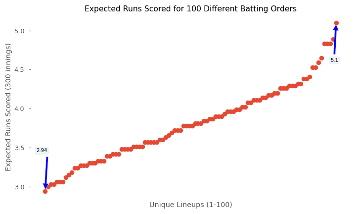
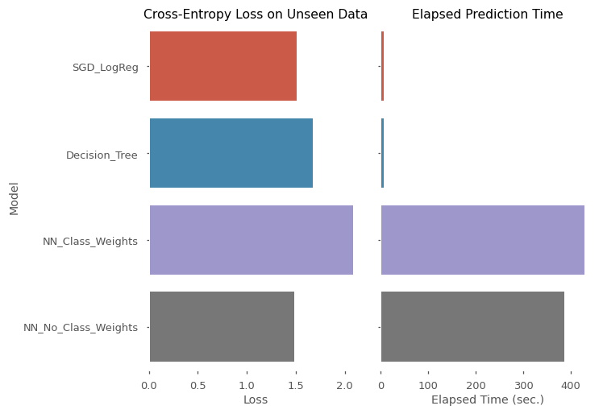

# Are Baseball Batting Orders Optimal?

## Business Understanding
**Sports Analytics**

In all sports, analytics are being used to leverage every possible advantage. In modern baseball particularly, there is a wealth of data: players prepare and improve their personal skills, managers position defenders in revolutionary ways, front offices use data to sign free agents and plan spending.

**Batting Orders**

Before a game is played, the manager (along with the coaching staff and front office) assigns a starting pitcher and a batting order. Starting pitchers are typically used  on a 5-day rotating schedule while batting orders are very often consistent for the season with an age-old "formula":
- *Your fastest player who's best at getting on base should bat first.*
- *Your best "contact"-hitter should bat second in order to advance the lead-off hitter.*
- *Your overall best hitter should bat third (hopefully with two players already on base).*
- *Your best power-hitter should hit fourth ("cleanup") to "clean up" the bases with a home-run ideally.*

... and so on down the batting order.

**Does the Batting Order Matter?**



When shuffling a lineup, there are 362,880 possible permutations. After taking 100 random permutations of a lineup, you can see the vast difference that the batting order makes on the expected runs scored.

**Can we improve on tradition?**

There is some intuition to this - especially that your best hitters should be hitting near the top of the batting order so they have more of a chance to get more plate-appearances in a game (the batting order rotates 1-9 back to 1 again). However, this concept of placing the hitters in this order is a hundred years old and should be challenged.

### Objectives
1. Use ML / Neural Networks to model baseball "events" (plate appearances). The models will use player data (Pitchers and Hitters) as well as additional game-data (temperature, field condition, etc) to **predict the outcome of a plate appearance.** 
 - *The predictions will importantly be **probabilistic** - showing the probability of each possible outcome (e.g.: Single, Out, Sacrifice, Strikeout). Therefore, the model should acknowledge some randomness involved.*
    - *Ex: If a player were to come to the plate in an identical situation 100 times, the results would vary even though the circumstances do not.*
2. Once we are able to figure probabilities of each outcome in a given situation, we will be **finding the optimal batting order** (measured by *expected runs-scored*).
 - *We will be simulating innings and measuring runs-scored while iterating through lineups.*

**After the *optimization* is run, we will be able to say what batting order will produce the most runs on a given day against a given pitcher with given conditions.**

# Baseball Simulator App

______ | ______
:---: | :---:
 | 

The app is deployed on *Heroku* and can be found <a href='https://capstone-baseball-simulator.herokuapp.com/'>**here**</a>!
> *https://capstone-baseball-simulator.herokuapp.com/*


# Project Outline

## Obtain - Scrub - Explore
### Scrape Data
The first hurdle to this project: *getting the data*. Luckily, baseball is extremely data-rich (lately, baseball and other professional sports are turning more and more to data analytics to provide an edge in competition) and its data spans back decades.

The `scrape_data_to_csv.py` file was written to scrape data from `retrosheet.org` - one of the better hubs for baseball data.

The file works in several steps to download and unzip regular-season event files into data folder (`./data/`). The files are extremely detailed and we are able to access every play from every regular-season game for over 100 years. The resulting tables we extracted were:
1. `GAMES`:
game_id, visiting_team_id, home_team_id, site_id, date, dblhdr_number, day_night, temp, wind, field_cond, precip, time_of_game, attendance
2. `EVENTS`:
game_id, inning_num, inning_half, hitter_id, pitcher_id, outcome
3. `TEAMS`:
team_id, year, league, location, name

*(**Note**: With some of the older game logs, some plays are abbreviated, estimated, or missing.)*

The main function scrapes the downloaded events files (*modified csv* files) into the above three tables, saves the tables, and deletes the originally downloaded files.

### Format "Outcome"
Once the data is scraped and organized, the next big step was to engineer the `outcome` (our modeling target variable).

> A detailed explanation of the `events` files can be found here: https://www.retrosheet.org/eventfile.htm, as well as a thorough description of **"Events made by the batter at the plate"**.

In `baseball_support.py`, the function `engineer_outcome(series)` reconstructs a Pandas.Series into two simplified and readable columns: `outcome` and `total_bases`.

An example of the original `outcome` column:
```
0             6/P
1               K
2             4/L
3           13/BG
4              HP
5    K+CS2(26)/DP
6              13
7               K
8           D7/7L
9              31
Name: outcome, dtype: object
```
Regular expressions were used to determine what kind of play the at-bat ended in. The resulting `outcome` has columns: `['S', 'D', 'T', 'HR', 'BB', 'K', 'SAC', 'O', 'E', 'I']` *(single, double, triple, homerun, base-on-balls/walk, strikeout, sacrifice, out, error, interference)*.

Since I wanted a simplified feature, some notable concessions were made. For example, an `outcome` of `'BB'` (which normally means only "walk") includes: walk, intentional-walk, and hit-by-pitch. Similarly, `O` includes ground-out, line-out, fly-out, double-play, fielder's-choice.

There are also certain at-bats which don't result in a happening at the plate (for example: if a base-runner gets thrown out attempting to steal). These examples are labeled as "no-result" or "no-play" and are dropped later.

The column `total_bases` is not used for modeling, but *is* used for simulations and player-stats.


### Engineer column: `prior_outcome`
I wanted to add in data from what else has happened in the current half-inning. Perhaps this would play a role in predicting the likelihood of certain outcomes vs others (if a pitcher is struggling - walking batters and giving up a lot of hits - there's a chance he will be less-effective for the upcoming batters).

To do this, we had to iterate over every row of event data and engineer the following `prior_outcome_lag{n}` columns:

|     | inning_half  | outcome   | prior_outcome_lag1    | prior_outcome_lag2    | prior_outcome_lag3    | prior_outcome_lag4    | prior_outcome_lag5    |
|---   |--- |---  |---   |---   |---   |---   |---   |
|10409 | 0  | K   | NONE | NONE | NONE | NONE | NONE |
|10410 | 0  | O   | K    | NONE | NONE | NONE | NONE |
|10411 | 0  | O   | O    | K    | NONE | NONE | NONE |
|10412 | 1  | S   | NONE | NONE | NONE | NONE | NONE |
|10413 | 1  | S   | S    | NONE | NONE | NONE | NONE |
|10414 | 1  | D   | S    | S    | NONE | NONE | NONE |
|10415 | 1  | S   | D    | S    | S    | NONE | NONE |
|10416 | 1  | K   | S    | D    | S    | S    | NONE |
|10417 | 1  | S   | K    | S    | D    | S    | S    |
|10418 | 1  | O   | S    | K    | S    | D    | S    |
|10419 | 1  | K   | O    | S    | K    | S    | D    |
|10420 | 0  | T   | NONE | NONE | NONE | NONE | NONE |
|10421 | 0  | K   | T    | NONE | NONE | NONE | NONE |
|10422 | 0  | BB  | K    | T    | NONE | NONE | NONE |
|10423 | 0  | BB  | BB   | K    | T    | NONE | NONE |
|10424 | 0  | O   | BB   | BB   | K    | T    | NONE |
|10425 | 0  | O   | O    | BB   | BB   | K    | T    |
|10426 | 1  | O   | NONE | NONE | NONE | NONE | NONE |
|10427 | 1  | BB  | O    | NONE | NONE | NONE | NONE |
|10428 | 1  | BB  | BB   | O    | NONE | NONE | NONE |

Importantly, the "prior" columns follow the `inning_half` column - meaning when the half-inning "flips" from `0` to `1`, the priors get erased.

### Creating and Populating a `League`
A big part of the engineering process was the `League` object filled with `Players` (both can be found in `league_player_classes.py`).

Simplest would be to show the example usage of the `League` and its intention:
```
>>> mlb = League()
>>> mlb
Number of Hitters: 0
Number of Pitchers: 0
Total Players: 0
```
> A `League` is created - essentially as a storage device to hold and retrieve the `Player` objects.

```
>>> claude = Hitter('cwf231')
>>> claude
Hitter(cwf231)

>>> mlb.add_player(claude)
>>> mlb
Number of Hitters: 1
Number of Pitchers: 0
Total Players: 1

>>> mlb.get_player('cwf231')
Hitter(cwf231)
```
> `Players` can be easily added and retrieved from the `League` via `player_id`.
>
> A `Hitter` is an object that holds career stats and up-to-date, play-by-play stats for every at-bat of their career (or at least from the start of the data that has been collected).

```
>>> claude.stats_heading_in()
(0, -1.0, -1.0)
```
> The `stats_heading_in` represents a snapshot of the `Player` at every moment in their career during the window of the data.

```
>>> claude.process_event_outcome('HR', 4)
>>> claude.process_event_outcome('S', 1)
>>> claude.process_event_outcome('BB', 0)
>>> claude.process_event_outcome('K', 0)
>>> claude.stats_heading_in()
(3, 0.3333333333333333, 2.416666666666667)
```
> A `Hitter` can process an `outcome` and update its rolling stats and `stats_heading_in` (which just means *stats heading in to their next at-bat*).
>
> A `Pitcher` is treated exactly the same way but with pitching stats.
> 
> `Hitter.stats_heading_in`: (*at-bats*, *strikeout-rate*, *on-base-plus-slugging*). 
>
> `Pitcher.stats_heading_in`: (`ip`, `whip`, `k_bb_ratio`)

```
>>> claude.rolling_stats
[{'bb': 0, 'k': 0, 'h': 0, 'sac': 0, 'tb': 0, 'ab': 0},
 {'bb': 0, 'k': 0, 'h': 1, 'sac': 0, 'tb': 4, 'ab': 1},
 {'bb': 0, 'k': 0, 'h': 2, 'sac': 0, 'tb': 5, 'ab': 2},
 {'bb': 1, 'k': 0, 'h': 2, 'sac': 0, 'tb': 5, 'ab': 2},
 {'bb': 1, 'k': 1, 'h': 2, 'sac': 0, 'tb': 5, 'ab': 3}]
```
> Concludes the example.

The `League` gets created as an empty object and is passed with a Pandas.DataFrame. The `League` then uses `self.populate_league_with(df)` which:
1. Iterates through all of the event-rows.
2. Gets the current hitter_ and pitcher_id.
3. Retrieves the `Player` if they're already in the `League` (or else creates new ones and saves them).
4. Updates the DataFrame to include the `Player`'s `{stat}_heading_in`.
5. Updates the `Player` objects with `Player.process_outcome()`.

In the end, the `events` data includes *live* player-data and the `League` contains *fitted* Player objects representing everyone who took an at-bat or pitched to a hitter since the start of the data.

### Prepare data for modeling.
Since we are modeling for `outcome`, we have some housekeeping to do. Some of this includes:
- Dropping unused or irrelevant features.
- Train-Test-Split
- Data Pipeline (`ColumnTransformer()`)
  - Scale, One-Hot-Encode, Label-Encode
- Gathering class weights for experimentation.

The final shapes of the processed X_train and X_test are:
`((8084697, 16452), (2694900, 16452))`

The final shapes of the processed y_train and y_test are:
`((8084697,), (2694900,))` (which must be transformed lated for our Tensorflow models).

## Model

### Fit: SGD / DT Classifiers
With the extremely wide data we have (without conceding to PCA for example), there are limitations to the modeling we can test realistically.

I decided to try a modest selection of a logistic regression model with stochastic gradient descent and a (very shallow) decision tree classifier.
*(SVC, KNN, and Random Forest classifiers can be ruled out for training because of the amount of time it would take.)*

It became clear that the SGD LogReg would be a very *cost-efficient* option based on its quick training time, even with tens of thousands of dimensions and millions of data points.

The Decision Tree took much longer to train and (probably due to its shallow nature) performed strictly worse than the LogReg.

### Fit: NN: With / Without Class Weights
It was clear that I should try out some Tensorflow Neural Networks, but quickly I noticed the scale of the models I was working with. Even a model with a single hidden layer was exceedingly large and took hours to train (Colab's TPUs). The final architecture was simple:
```
_________________________________________________________________
Layer (type)                 Output Shape              Param #   
=================================================================
dense (Dense)                (None, 16452)             270684756 
_________________________________________________________________
dense_1 (Dense)              (None, 100)               1645300   
_________________________________________________________________
dropout (Dropout)            (None, 100)               0         
_________________________________________________________________
dense_2 (Dense)              (None, 10)                1010      
=================================================================
Total params: 272,331,066
Trainable params: 272,331,066
Non-trainable params: 0
_________________________________________________________________
```
*272 million trainable parameters with a single hidden layer.*

I was interested to experiment as well with the class imbalance, but was quickly able to confirm my initial hesitation. By adding in class weights to the model, it was overfitting massively on the training set - trying hard to find those valuable and rare scenarios where there was a *defensive interference* or a *triple* hit. 

Because there is randomness in sports, there isn't a way to predict if the next play will involve a *catcher's interference*.

### Compare models: cross-entropy loss, performance time.
While the Neural Network without class weights performed the best overall (cross-entropy loss), there was a clear difference in the amount of time it took to make its predictions and the size of the model itself.



### Validate against real season-data.
As a fun way to validate the models' predictions, I decided to simulate two real lineups from an arbitrary year (2010) and see how the simulated games compared to the actual team performance.

*Again, this is imperfect because the Opening-Day lineup was used to simulate all of the games, while in reality the lineup changes throughout the season - either with substitutions or even only with shuffling around - from one game to the next. Also, a random pitcher was selected from the league to face the lineup which (again) is not realistic because the pitcher would change every day.*

However, even with these caveats, the models showed a respectable ability to simulate the team's performance over an 81-home-game stretch. The difference between the two teams is obvious (the league-leading Yankees clearly are expected to score significantly more runs than the league-worst Mariners when facing the same pitcher).

***Yankees***
```
Actual:    Average Runs per Game: 4.518518518518518
```
> **Neural Network:**
> ```
> Simulated: Average Runs per Game: 4.296296296296297
> ```
> 
> 
> **SGD:**
> ```
> Simulated: Average Runs per Game: 5.061728395061729
> ```
> 

***Mariners***
```
Actual:    Average Runs per Game: 3.753086419753086
```
> **Neural Network**:
> ```
> Simulated: Average Runs per Game: 3.9135802469135803
> ```
> 
> 
> **SGD**:
> ```
> Simulated: Average Runs per Game: 4.691358024691358
> ```
> 

Clearly, the Neural Network returned a much closer prediction to reality (the SGD was ballooning predicted runs-scored).

## Conclusions
We can conclusively say that the batting order makes a difference in expected runs scored. With 100 randomly selected permutations of a lineup, after running simulations totaling 300-innings the differences were dramatic.


### SGD chosen for lightweight and fast deployment.
Due to the fact that I wanted to deploy the model to be a Heroku app, I needed to consider performance as well as accuracy. I therefore picked the SGD LogReg Classifier as my premiere model.

### Heroku app deployed with ability to simulate games.
https://capstone-baseball-simulator.herokuapp.com/


```python

```
